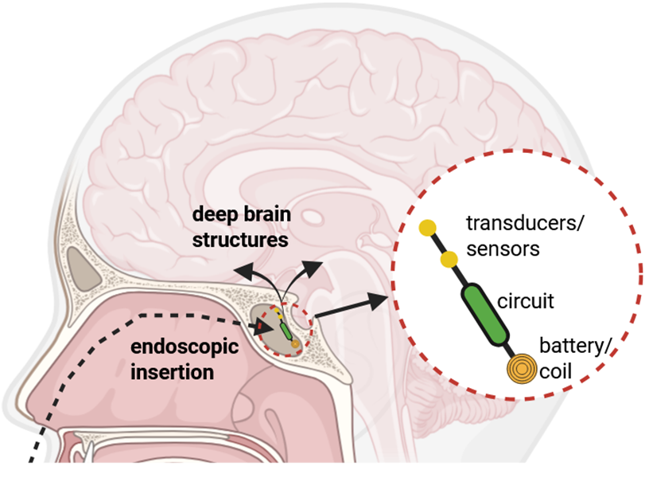
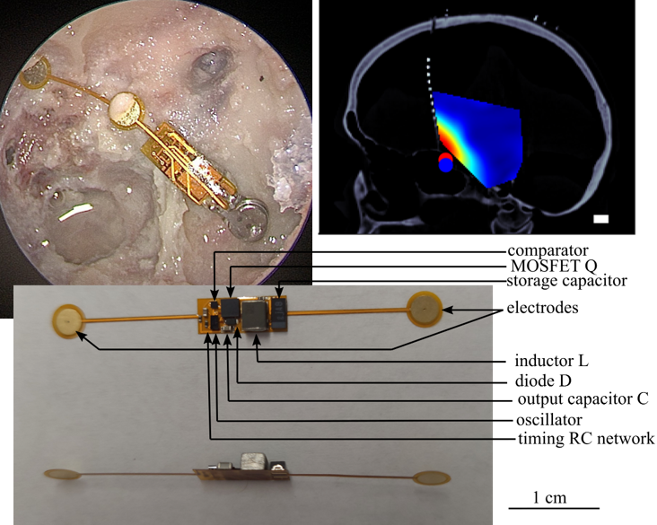
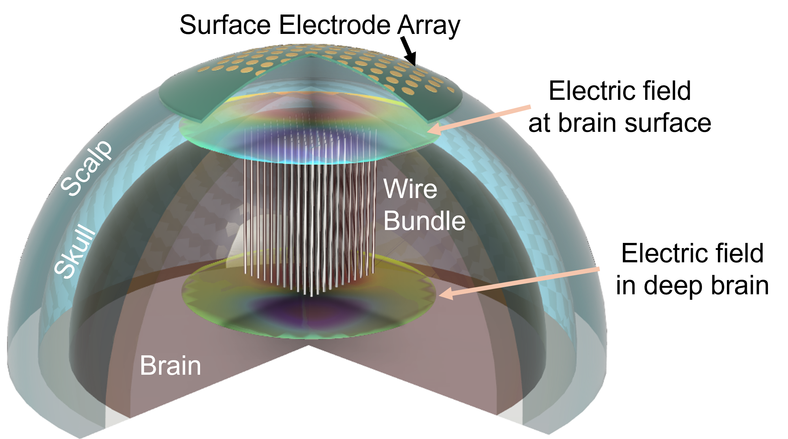

I am a postdoctoral research scientist working on building new minimally invasive neuromodulation technologies. My work sits at the intersection between Electrical Engineering and Neuroscience, combining expertise in microscale devices, machine learning based optimization, and biology experiments. 

Research projects
======

Sphenoid implant for minmally-invasive deep brain stimulation and sensing
----

Transcranial electrical stimulation (TES), and other noninvasive neural interfacing modalities, cannot reach deep brain regions due to dispersion of energy with distance. However, deep brain regions contain very important brain areas (e.g. many nodes of the reward, pain, and motor circuits, hormonal systems, etc.). I have recently developed a new technique for minimally invasive stimulation of the deep brain via electrodes inserted through the nose in a routine endoscopic procedure. Initial simulations and experimental validation in cadaver specimens demonstrate the incredible potential of this technique. 

I am currently developing miniaturized implantable sensors (EEG, fNIRS) to allow recording of deep brain regions and future closed-loop integration with the stimulators.  

Relaying transcranial electric fields to deep brain using minimally-invasive floating wires
------

Another technique I am developing to stimulate deep brain regions with reduced surgical burden compared to state-of-the-art DBS is through a combination of scalp electrodes (performing transcranial electrical stimulation) with implanted passive, untethered microwires (which relay the electric field from the brain surface to the target depth). Simulations and benchtop experiments demonstrate that the passive floating wires are able to couple electric field to the regions of interest, and in vivo experiments in mice have shown successful stimulation of the subthalamic nucleus (STN) through realyed TES. 

High-resolution, low-pain transcranial electrical stimulation
----

I am also passionate about developing high-performance non-invasive neural interfaces, in particular pulsed transcranial electrical stimulation (pTES) a powerful technique which is has not received much attention in the last few decades (and has largely been supplanted by TMS, transcranial magnetic stimulation, in research as well as many clinical applications). Through fundamental studies of biophysical interaction between electric fields and neurons, I have achieved unprecedented stimulation accuracy in rodents. Translation to humans required developing new techniques to reduce scalp pain occurring during administration of the pulses, whcih led to the discovery of background hums, a low-amplitude, high frequency train of pulses whose sole purpose is the reduction of painful sensation during TES pulse delivery. This technique enabled the first trial of pTES in chronic pain patients with fibromyalgia, and I am currently exploring more potential clinical use cases. 

